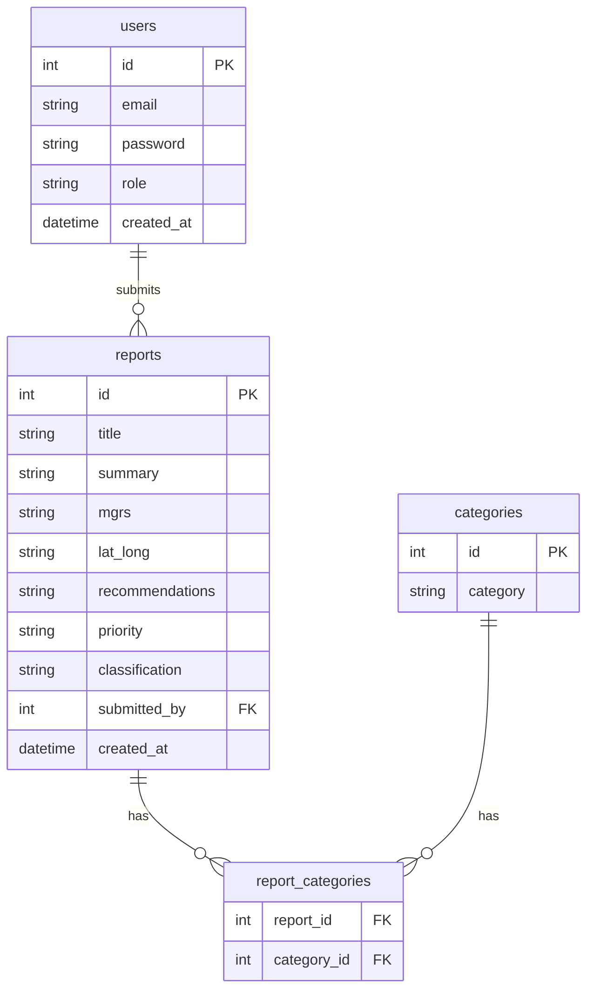

# CKIP (Civil Knowledge Integration Platform)

CKIP is a full-stack intelligence reporting platform for capturing and analyzing field observations on an interactive map.

Analysts can:

- authenticate into the platform
- submit geo-tagged reports (MGRS + lat/long)
- classify and prioritize reports
- filter/search/sort reports
- review report details with timeline and map context

---

## Problem Statement

Operational teams often track civil and human terrain reporting in fragmented tools (spreadsheets, ad hoc notes, chat threads). That creates three major issues:

1. **Low situational awareness** – information is not centralized or easy to visualize spatially
2. **Poor retrieval** – historical records are hard to search, filter, and export consistently
3. **Slow triage** – high-priority updates can be buried in unstructured reporting

CKIP addresses these issues by combining a map-first dashboard with structured report metadata (priority, classification, categories, author, date) and a filterable reporting interface.

---

## What the App Does

### Core capabilities

- **Authentication + role awareness**
  - Register, login, logout, and session cookie auth
  - Role is attached to the signed-in user and shown in the UI
- **Dashboard map + report submission**
  - Displays report markers on a Leaflet map
  - Click-to-populate MGRS and lat/long in the submit form
  - Supports categories, priority, and classification fields
- **Report management**
  - List reports with query-driven filters and pagination
  - Search by text (`q`) and filter by category/priority/date range
  - Sort and export selected reports to PDF
- **Report detail view**
  - Dedicated screen for deeper review with map, side panel, timeline, and bottom detail card

### Main routes

- `/` → Login
- `/signup` → Access request / registration
- `/dashboard` → Map and report creation
- `/reports` → Reports list with filters
- `/reports/:title` → Report details

---

## Architecture (High Level)

- **Frontend**: React + Vite + React Router + React Leaflet
- **Backend**: Express + Knex
- **Database**: PostgreSQL
- **Auth**: JWT stored in `httpOnly` cookie
- **Infra**: Docker Compose for frontend, backend, and database

---

## ERD



---

## Wireframes (Text)

> These are implementation-aligned wireframes to communicate layout and flow.

### 1) Login

```text
+--------------------------------------------------+
| CKIP // v2.1                                     |
| [Authorized access only]                         |
|                                                  |
| Sign in                                          |
| Civil Knowledge Integration Platform             |
|                                                  |
| Email:    [______________________________]       |
| Password: [______________________________]       |
|                                                  |
|            [ Authenticate ]                      |
|                                                  |
| No account? Request access                       |
+--------------------------------------------------+
```

### 2) Dashboard (Map + Submit)

```text
+--------------------------------------------------------------------------------+
| Header: CKIP | Dashboard | Reports | Logout | Role                             |
+--------------------------------------------------------------------------------+
| METRICS: [Total Reports] [Pending Review] [Priority Alerts]                    |
|                                                                                |
| +-------------------------------+  +----------------------------------------+  |
| | Leaflet Map                   |  | New Report Form                        |  |
| | - report markers              |  | title                                  |  |
| | - click map -> MGRS/lat-long  |  | summary                                |  |
| |                               |  | recommendations                        |  |
| |                               |  | MGRS / lat_long                        |  |
| |                               |  | priority / classification / categories |  |
| |                               |  | [Submit]                               |  |
| +-------------------------------+  +----------------------------------------+  |
+--------------------------------------------------------------------------------+
```

### 3) Reports List

```text
+--------------------------------------------------------------------------------+
| Header: CKIP | Dashboard | Reports | Logout | Role                             |
+--------------------------------------------------------------------------------+
| Search [__________________]  Filters: categories | priorities | date_range     |
| Sort: created_at (asc/desc)                                           Export PDF |
|----------------------------------------------------------------------------------|
| [ ] Report Row 1 (title, metadata, tags, priority, classification, date)        |
| [ ] Report Row 2                                                                 |
| [ ] Report Row 3                                                                 |
| ...                                                                              |
|----------------------------------------------------------------------------------|
| Pagination: < Prev | Page X of Y | Next >                                        |
+--------------------------------------------------------------------------------+
```

### 4) Report Details

```text
+--------------------------------------------------------------------------------+
| Header                                                                         |
+--------------------------------------------------------------------------------+
| Subheader: title / priority / classification                                   |
|                                                                                |
| +------------------------------------+ +------------------------------------+   |
| | ReportDetailsMap                   | | Side Section                       |   |
| |                                    | | Timeline                           |   |
| +------------------------------------+ +------------------------------------+   |
|                                                                                |
| Bottom Card: summary, recommendations, metadata, categories                    |
+--------------------------------------------------------------------------------+
```

---

## Local Setup Prerequisites

- Node.js 20+
- npm 10+
- Docker + Docker Compose (recommended path)

### Option A: Docker Compose (recommended)

1. Create env files from examples:

```bash
cp backend/.env.example backend/.env.development
cp frontend/.env.example frontend/.env.development
```

2. Populate variables (see [Environment Variables](#environment-variables)).
3. Build and start services:

```bash
docker compose up --build -d
```

4. Run DB migrations and seeds inside backend container:

```bash
docker compose exec backend npm run migrate
docker compose exec backend npm run seed
```

5. Open:

- Frontend: `http://localhost:5173`
- Backend: `http://localhost:8080`

### Option B: Run services locally (no Docker)

From separate terminals:

```bash
# backend
cd backend
npm install
npm run migrate
npm run seed
node src/server.js
```

```bash
# frontend
cd frontend
npm install
npm run start
```

---

## Environment Variables

### `backend/.env.development`

```bash
NODE_ENV=development

DB_HOST=localhost
DB_PORT=5432
DB_USER=postgres
DB_PASSWORD=postgres
DB_NAME=ckip

POSTGRES_USER=postgres
POSTGRES_PASSWORD=postgres
POSTGRES_DB=ckip

CLIENT_URL=http://localhost:5173

JWT=replace-with-strong-random-secret
PORT=8080
```

### `frontend/.env.development`

```bash
NODE_ENV=development
VITE_API_URL=http://localhost:8080
```

> Note: `PORT` is optional for backend (defaults to `8080` if unset).

---

## Seed Instructions

The seed pipeline inserts synthetic users/reports and category links.

### Command sequence

```bash
cd backend
npm run migrate
npm run seed
```

### What gets seeded

- `users`: **100** generated users
- `reports`: **100** generated reports
- `categories`: fixed list (11 values)
- `report_categories`: generated many-to-many links for seeded reports

### Full reset (rollback + migrate + seed)

```bash
cd backend
npm run reset
```

---

## Future Improvements

- Users can only edit their own reports
- Admins can add, edit, or delete any report or category
- Refactor Dashboard.jsx, Reports.jsx
